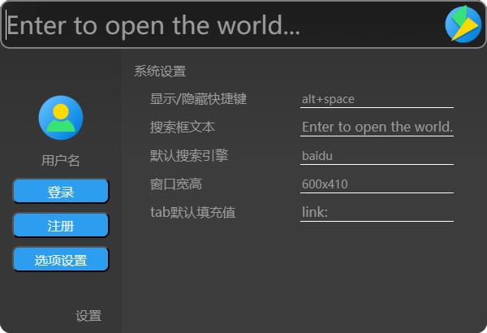

# 配置文件

如何配置**Flash**内容，可以修改配置文件，或者从软件内设置页面修改。

## 配置文件修改配置

修改配置文件 `config/flash.config.json`

```json title="flash.config.json"
{
  "setting": {
    "shortcut": "alt+space", //显示/隐藏快捷键
    "search_text": "Enter to open the world...", //搜索框显示文本
    "search_engine":"baidu", //默认搜索引擎,支持内容: baidu、biying、csdn
    "window_size": "600x410", //窗口大小,支持内容: 600x410、700x510
    "tab_value": "link:" //tab快捷键填充内容
  },
  "option": [
    {
      "name":"github", //选项名称
      "option_type":"link", //选项类型: 链接、文件、项目等
      "open_in":"", //为空,使用默认浏览器
      "path":"github.com", //打开路径
      "describe":"github地址" //描述
    }
  ]
}
```

## 设置页面修改配置

